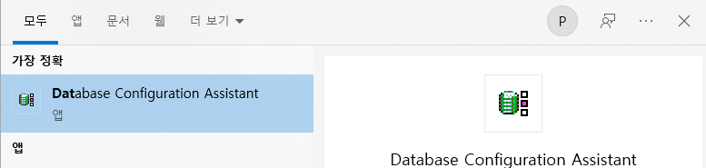

# Oracle_Install

구글에서 oracle database 19c 를 검색한다.

[Oracle Database 19c Download for Microsoft Windows x64 (64-bit)](https://www.oracle.com/kr/database/technologies/oracle19c-windows-downloads.html)

설치 하기 .

- 단일 인스턴스로 설치하였다.
    - 전역 데이터베이스 myoracle
- 소프트워어만 설정 설치 하게 되면 ...
    - 전역데이터 베이스 (X)
    - DB 생성
- 데이터 생성모드 선택 ASM 으로 안되면 파일시스템으로 해서 해준다.




- 단일 인스턴스로 설치


- 데스크톱 클래스로 설정


- 가상 계정 사용으로 설정


- 데이터베이스 이름을 myoracle 로 설정


- 설치


- SQL Plus를 실행한다 (사용자명 : system, 비밀번호 : 1234 로 하였다.)


- 테이블스페이스 생성
    
    CREATE TABLESPACE myts DATAFILE 'C:\app\oradata\MYORACLE\myts.dbf' SIZE 100M AUTOEXTEND ON NEXT 5M;
    


- 사용자 생성
    
    `CREATE USER ora_user IDENTIFIED BY EOM DEFAULT TABLESPACE MYTS TEMPORARY TABLESPACE TEMP;`
    
    ```sql
    CREATE USER ora_user IDENTIFIED BY EOM
    DEFAULT TABLESPACE MYTS
    TEMPORARY TABLESPACE TEMP;
    ```
    


- 롤 부여하기 / 사용자 계정으로 DB에 접속하기
    - 사용자 생성을 완료한 뒤에는 해당 사용자에게 롤 을 부여해야 한다.
    
    ```sql
    GRANT DBA TO ora_user;
    select user from dual;
    ```
    


- Oracle SQL Developer 실행


- 새 데이터베이스 접속을 눌러 준다.


- 입력값을 입력 하고 테스트를 눌러 줬는데 실패가 떴다.


- 명령 프롬프트 실행해서 lsnrctl status 입력하여 확인한다.


- 리스터가 없으면 Oracle Net Configuration 을 실행해서 리스너를 구성해준다.


- 도구 - 환경 설정 - NLS - 시간 기록 형식 : YYYY/MM/DD HH24:MI:SS 변경하였다.


- SELECT user from DUAL; 입력하여 확인.


- 아래 깃허브에 접속해서 파일 두개를 받아 c드라이브 아래 backup폴더를 생성해서 받아준다.

[006696/01장 환경설정 at master · gilbutITbook/006696](https://github.com/gilbutITbook/006696/tree/master/01%EC%9E%A5%20%ED%99%98%EA%B2%BD%EC%84%A4%EC%A0%95)

- 명령 에서 imp ora_user/EOM file=expall.dmp log=empall.log ignore=y grants=y rows=y indexes=y full=y


- imp ora_user/EOM file=expcust.dmp log=expcust.log ignore=y grants=y rows=y indexes=y full=y


- SELECT table_name FROM user_tables;


# 오라클 접속


- 위의 scott/tiger 대신에 ora_user / 비밀번호 입력하였다.


# 오라클 실행

- 테이블 생성

```sql
CREATE TABLE ex2_1 (
    COLUMN1 CHAR(10)
    , COLUMN2 VARCHAR2(10)
    , COLUMN3 NVARCHAR2(10)
    , COLUMN4 NUMBER
);
```


- 테이블을 열어 확인.


- 쿼리 확인

```sql
CREATE TABLE "ORA_USER"."EX2_1" 
   (	"COLUMN1" CHAR(10 BYTE), 
	"COLUMN2" VARCHAR2(10 BYTE), 
	"COLUMN3" NVARCHAR2(10), 
	"COLUMN4" NUMBER
   ) SEGMENT CREATION DEFERRED 
  PCTFREE 10 PCTUSED 40 INITRANS 1 MAXTRANS 255 
 NOCOMPRESS LOGGING
  TABLESPACE "MYTS" ;
```


```sql
-- 데이터 추가
INSERT INTO ex2_1 (COLUMN1, COLUMN2) VALUES('abc', 'abc');

-- 데이터 확인
SELECT 
    COLUMN1
    , LENGTH(COLUMN1) as len1
    , COLUMN2
    , LENGTH(COLUMN2) as len2
FROM ex2_1;
```